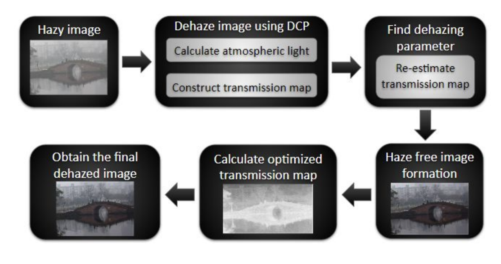

# Image Dehazing Optimal using Dark Channel Prior

Haze is a common phenomenon in digital images which shows poor visibility and contrast. The images might be degraded due to the influence of atmospheric light
or the poor quality of sensors. Hazy images may cause blur in edges or miss many details in an image.The objective of image analysis is to improve the visibility, 
recovery of constituent colors,  as well as constituting image parameters as if the image was captured or acquired under favorable conditions. Image dehazing aims
to recover real scene information covered by haze in sensor images through relevant technical means and methods to obtain complete details, structural information,
and natural haze-free images.

The Image Dehazing using DCP was implemented as a final project for **Digital Image Processing** course.

## Required Libraries 
* OpenCV
* scikit-image
* Numpy

## Implementation
The overview is explained through below flowchart.

## Results
We conducted experiments on both synthetic and real-world hazy images. The experimental results can be found in the folders hazy images and Experimentation. 

